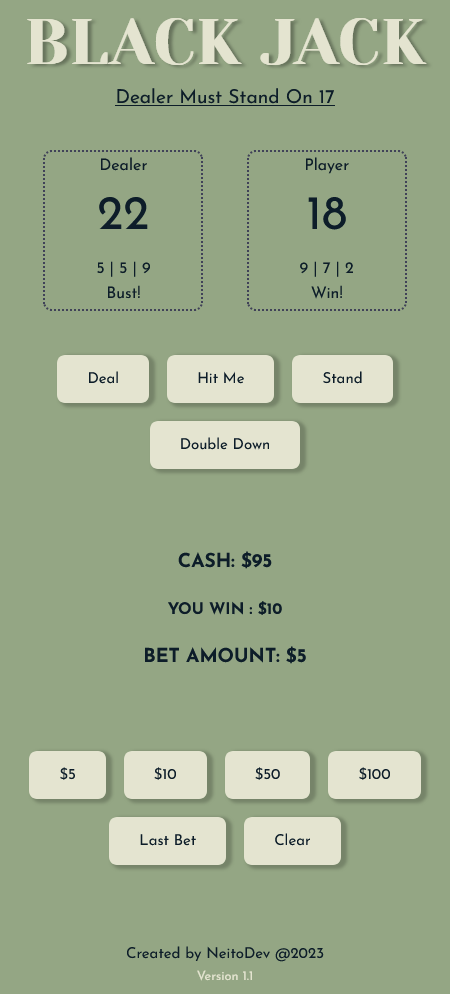

# BLACK JACK BY NEITODEV

[LIVE LINK](https://neitodesu.github.io/black-jack-js/)

---

### Made with mobile in mind first. Desktop version still WIP.

Black jack with pure RNG 🃏

Made with HTML, SCSS, and Javascript.

Based on pure RNG

**Rules**

1. Object of the game is to beat the dealer by getting a count of cards equal or closest to 21, without going over.
2. If count goes over 21, you lose.
3. Dealer must stay on 17.
4. Must place bets before dealing.
5. If you run out of cash, just refresh page.

Thank you for playing!

Good Luck!

